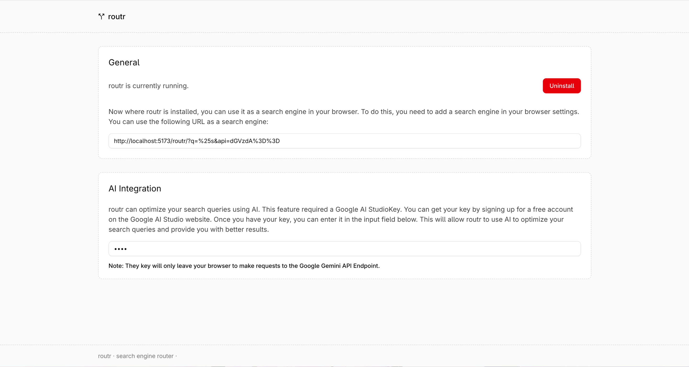

# routr

> A powerful browser search engine router with AI query optimization capabilities (Proof of Concept)

Routr is a web application that enhances your search experience by providing quick shortcuts to different search engines and optimizing your search queries using AI. It works as a service worker that intercepts and redirects your search queries based on predefined prefixes.



## Features

- **Search Engine Routing**: Quickly switch between search engines using prefixes (e.g., `!g` for Google, `!ddg` for DuckDuckGo)
- **AI Query Optimization**: Enhance your search queries with Google's Gemini AI for more effective results
- **Lightweight**: Runs as a service worker in your browser with minimal overhead
- **Privacy-Focused**: Your API keys remain in your browser and are only used for API requests
- **Easy Installation**: Simple one-click installation process

## Installation

1. Visit the Routr web application
2. Click the "Install" button
3. Add the provided URL as a search engine in your browser settings

## Usage

### Basic Search Routing

Use prefixes to route your searches to different engines:

- `!g search term` - Search on Google
- `!ddg search term` - Search on DuckDuckGo
- `!b search term` - Search on Bing
- `!yt search term` - Search on YouTube
- `!w search term` - Search on Wikipedia

If no prefix is provided, the search defaults to Google.

### AI-Enhanced Search

Double prefix enables AI optimization of your search query:

- `!!g complex search query` - Optimize and search on Google
- `!!ddg complex search query` - Optimize and search on DuckDuckGo

To use the AI optimization feature:

1. Obtain a Google AI Studio API key from [Google AI Studio](https://aistudio.google.com/)
2. Enter your API key in the Routr settings
3. Use the double prefix syntax for your searches

## Development

```bash
# Install dependencies
bun install

# Start development server
bun run dev

# Build for production
bun run build
```

## Technologies

- React 19
- Vite
- TypeScript
- Tailwind CSS
- Service Workers
- Google Gemini API

## Privacy

Routr takes your privacy seriously:
- Your API key never leaves your browser except to make requests to the Google Gemini API
- No data is collected about your search queries
- No cookies or tracking mechanisms are implemented

> [!Warning]
> While Routr does not collect data, please be aware that the search engines and the Gemini API you use may track your searches. Always check the privacy policies of the search engines you use.

## Disclaimer

This is a proof of concept project and may not be suitable for production use.

